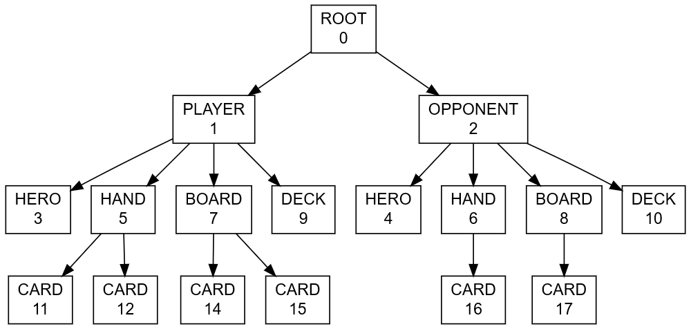

## Composantes du système

Le système de multijoueur est composé de trois logiciels:

### Le client

Le logiciel client est le jeu en lui-même. Les contraintes anti-triches sont telles que:

* Il ne doit jamais posséder les informations concernant les cartes de l'autre joueur
* Il ne doit pas connaître les cartes qu'il possède dans son deck.

### Le service d'authentification

Le service d'authentification est un logiciel qui gère les comptes des joueurs et qui centralise les informations les concernant. Il a accès à la base de données qui contient:

* Les comptes des utilisateurs
* L'historique des parties
* Le répertoire de serveurs de jeu
* La référence aux parties en cours

C'est un serveur qui répond aux requêtes liées à la manipulation de ces données.

### Le serveur

Le serveur de jeu gère les parties et peut posséder plusieurs salons. Il possède toutes les informations dans une partie et les centralise.

Les contraintes d'information sont les suivantes:

* Un serveur agréé doit pouvoir enregistrer chaque partie dans l'historique de partie.
* Le logiciel du serveur doit pouvoir être distribué librement et pouvoir vérifier l'authenticité des utilisateurs.

Un serveur peut donc être:

* Officiel ou non-officiel
  Un serveur officiel, hébergé par nous va pouvoir enregistrer auprès du service d'authentification l'historique des parties, et afficher en priorité dans la liste des serveurs.
* En ligne ou hors-ligne
  Un serveur en ligne va vérifier auprès du service d'authentification que chaque joueur qui se connecte possède un compte utilisateur.

## Fonctionnement de ce système

Le client (le jeu) est écrit en C# avec Unity. Le service d'authentification et le serveur de jeu sont écrits en Java et leurs fonctionnalités réseaux sont écrites avec le framework Netty. Le protocole utilisé pour toutes les connexions est TCP.

Les messages échangés entre les 3 composants sont encodés au format JSON. Le format est arbitraire et est justifié par les éléments suivants:

* C'est un format simple à utiliser.
* De nombreuses bibliothèques existent pour l'interpréter.
* Il est léger et est adapté aux contraintes de temps-réel imposées par un jeu de cartes en tour par tour.

### Définition des messages

Un message est défini au format JSON de cette manière:

```json
{
    "name" : "nom_message",
    "properties" : {
        "propriété1" : "valeur1",
        "propriété2" : "valeur2"
    }
}
```

Il possède des propriétés (ou paramètres) variaiables.

Dans le tableau suivant, les colonnes E et R correspondent aux composants du système envoyant ou recevant le message correspondant. Composants identifiés par les lettres: **A** pour le service d'authentification, **C** pour le client, et **S** pour le serveur de jeu. ★ signifie "tous les composants".

|    Identifiant    |      Paramètres       |                      Détails                       |      E      |      R      |
| :---------------: | :-------------------: | :------------------------------------------------: | :---------: | :---------: |
|        ok         |           -           |              Message de confirmation               |      ★      |      ★      |
|       error       |     code, message     |                Notifie d'une erreur                |      ★      |      ★      |
|       auth        |  username, password   |             Requête d'authentification             |      C      |      A      |
|    user_token     |         token         |      Réponse à la requête d'authentification       |      A      |      C      |
|   servers_list    |      user_token       |      Demande de la liste des serveurs de jeu       |      C      |      A      |
|      servers      |         list          |    Réponse à la requête de la liste de serveurs    |      A      |      C      |
|       poke        |  name, address, port  |       Notification de présence d'un serveur        |      S      |      A      |
|   push_history    |          (*)          |   Enregistrement d'une partie dans l'historique    |      S      |      A      |
|   prepare_game    |      user_token       |        Requête de préparation d'une partie         |      C      |      A      |
|    game_token     |         token         |       Réponse à la préparation d'une partie        |      A      |      C      |
|    check_game     |      game_token       |      Vérification de la validité d'une partie      |      S      |      A      |
|       user        |  user_id, pseudonym   |  Réponse à la requête de validité, avec le joueur  |      A      |      S      |
|       info        |           -           |         Requête d'informations au serveur          |      ★      |      S      |
|    server_info    |  name, online, rooms  |  Réponse contenent les informations d'un serveur   |      S      |      ★      |
|     join_room     |  room_id, game_token  |       Un client demande à rejoindre un salon       |      C      |      S      |
| join_room_offline |  room_id, pseudonym   | Pareil que précédent, pour les serveurs hors ligne |      C      |      S      |
|  opponent_event   |         event         |     Envoie un évènement relatif à l'adversaire     |      S      |      C      |
|     quit_room     |           -           |  Un joueur quitte ou se fait expulser d'un salon   |    S, C     |    C, S     |
|       ready       |         ready         |      Un joueur est prêt à démarrer la partie       | C, <u>S</u> | S, <u>C</u> |
|   game_starting   |           -           |           Notifie que la partie démarre            |      S      |      C      |
|    initialize     |     game_objects      |  Envoie la liste des objets de partie à son début  |      S      |      C      |
|      all_set      |           -           | Notifie qu'un client est prêt à démarrer la partie | S,<u>C</u>  | C, <u>S</u> |
|   game_started    |           -           |          Notifie que la partie a démarré           |      S      |      C      |
|     your_turn     |           -           |       Notifie à un joueur que c'est son tour       |      S      |  <u>C</u>   |
|     turn_end      |           -           |   Un joueur notifie que c'est la fin de son tour   |      C      |      S      |
|       cast        | object_id, target_id  |            Caste un objet sur un autre             | C, <u>S</u> | S, <u>C</u> |
|       state       |    card_id, state     |             Change l'état d'une carte              | C, <u>S</u> | S, <u>C</u> |
|  surrender / ff   |           -           |                 Un joueur se rend                  | C, <u>S</u> | S, <u>C</u> |
|   object_change   | object_id, properties |         Les propriétés d'un objet changent         |      S      |      C      |
|     game_end      |      reason_code      |        La partie se termine avec une raison        |      S      |      C      |
|      object       |         (**)          |      Insertion d'un nouvel objet côté client       |      S      |      C      |

*: application_token, player1_id, player2_id, winner_id?, time_started, time_ended, events
\*\*: object_id, type, parent, properties

### Certaines mécaniques détaillées

#### Authentification

L'authentification d'un joueur se fait grâce au message `auth`. Le serveur d'authentification lui renvoie un jeton d'authentification avec le message `auth_token`. Ce jeton de session est temporaire et va servir à manipuler ses données auprès du serveur d'authentification jusqu'à sa déconnexion, comme pour:

* Modifier ses decks
* Modifier son pseudonyme
* Demander la connexion à un salon avec `prepare_game`

#### Liste de serveurs

Les serveurs de jeu sont répertoriés dans la base de données auprès du service d'authentification. N'importe quel serveur qu'il soit officiel ou non-officiel peut demander à être répertorié en notifiant son existence auprès de ce dernier à l'aide du message `poke`. Ce message doit être envoyé périodiquement pour que l'entrée n'expire pas. Ainsi, le serveur fournit constamment son nom et son point de terminaison (adresse et port). Les serveurs officiels sont entrés manuellement dans la base de données.

Un client peut demander la liste des serveurs en envoyant le message `servers_list` au service d'authentification et en fournissant son jeton d'utilisateur. Il devrait recevoir un message `servers` contenant la liste. Cette liste est en réalité un tableau composée d'objets JSON comme ceci:

```json
{
    "name" : "un super serveur!",
    "address" : "chihuahua.iut-deck.fr",
    "port" : 4257,
    "official" : true
}
```

Le client récupère donc le nom, l'adresse, et le port du serveur et son authenticité (s'il est officiel ou non).

#### Récupérer les salles d'un serveur

Un client peut récupérer les informations concernant un serveur en lui envoyant le message `info`. Le serveur lui répondra avec un message `server_info` contenant son nom, s'il est en ligne (ou hors ligne), et un tableau de salons numérotés à partir de 1. Ces salons sont des objets de la forme:

```json
{
    "id" : 4,
    "slots_available" : 1
}
```

#### Connexion à une partie

Pour se connecter à un salon d'un serveur qui est en ligne, le client doit demander à préparer sa connexion auprès du serveur d'authentification avec le message `prepare_game`. Il reçoit ensuite un jeton de jeu avec la réponse `game_token`. C'est ce jeton qu'il va devoir communiquer au serveur lors de sa tentative de connexion à un salon, avec le message `join_room`. Ainsi, le serveur va vérifier sa validité auprès du service d'authentification via le message `check_game` et va pouvoir récupérer auprès de celui-ci les identifiants certifiés valides du joueur grâce à la réponse `user`.

Lorsque le serveur est hors-ligne, cet échange avec le service d'authentification est inutile, le message que doit envoyer le client est donc `join_room_offline` en communiquant lui-même son pseudonyme.

Lorsque le client a rejoint un salon avec succès, sa connexion auprès du serveur reste active jusqu'à la fin de la partie. Les messages échangés dans ce cas peut être appelés des *évènements*.

#### Historique de parties

Seuls les serveurs officiels peuvent soumettre une entrée de l'historique au service d'authentification. Chaque serveur officiel possède un jeton d'application qui lui permet de manipuler certaines données officielles comme l'historique des parties. Ce jeton est renseigné manuellement.

À la fin d'une partie, le serveur de jeu envoie au service d'authentification un message `push_history` en fournissant son jeton d'application et les informations suivantes:

* L'identifiant de chaque joueur, récupéré précedemment avec le message `user`.
* L'identifiant du vainqueur. Ce paramètre peut être nul lorsqu'une partie s'est terminée subitement par exemple
* Les dates de début et de fin de partie, sous forme de timestamp UNIX en millisecondes.
* Un tableau d'évènements.

Les évènements sont la trace des messages communiqués entre le serveur et les clients.
Seuls les messages permettant de reconstruire le déroulement de la partie sont transmis.
Pour cela, chaque message est associé à un timestamp UNIX en millisecondes, permettant de les ordonner dans le temps.

#### Messages de l'opposant

Dans le tableau, les envoyeurs ou destinataires soulignés indiquent que le message correspondant peut être reçu ou envoyé par le biais d'un message `opponent_event`. Ce message permet d'enrouler des évènements caractérisant une action de l'autre joueur. Ce message peut-être reçu par exemple pour notifier que l'autre joueur est prêt en enroulant un message `ready`, ou plus communément au cours de la partie en enroulant des messages comme `cast` ou `state`.

#### Objets de jeu

La structure de données définissant les objets de jeu pouvant intéragir ensemble est un arbre dont les noeuds sont composés d'un type, d'un identifiant et de l'objet en lui-même.
Chaque objet peut avoir des propriétés: une carte a des statistiques et un état (défense ou attaque), un professeur a des points de vie, un joueur a de la mana.

Les types possibles sont:

|   Type   |      Description       |
| :------: | :--------------------: |
|   ROOT   |   Racine de l'arbre    |
|  PLAYER  |     Joueur courant     |
| OPPONENT |       Adversaire       |
|   HERO   | Professeur d'un joueur |
|   HAND   |    Main d'un joueur    |
|  BOARD   |  Plateau d'un joueur   |
|   DECK   |    Deck d'un joueur    |
|   CARD   |       Une carte        |

On peut imaginer vouloir ajouter d'autres types pour étendre le jeu lors de prochaines mises à jour.

Exemple de la structure d'un joueur:



On peut donc facilement les stocker dans un tableau associatif côté client ou côté serveur. Lors d'une partie multijoueur, cette structure est modifiée avec les messages `initialize` pour construire l'arbre avant le début de la partie, `object_change` pour changer les propriétés d'un objet, et `object` pour insérer un nouvel objet.

#### Casts

Les casts permettent de formaliser les actions lors d'une partie, c'est l'application d'un objet de jeu sur un autre. Les casts possibles sont fixes et définis en associant deux types d'objet: un type source et un type de destination. Côté serveur, cette association est liée à une action, car seul le serveur est habilité à les exécuter.

Par exemple, pour appliquer l'effet d'une carte sur une autre carte, on associe `CARD` avec `CARD`. Dans ce cas-là, l'action dépend de plusieurs éléments comme le propriétaire de chaque carte. On peut aussi associer `CARD` avec `HERO` pour permettre à une carte d'attaquer le professeur de l'autre joueur.

Appliquer un objet de jeu à lui-même est autorisé. C'est le cas par exemple lorsqu'on veut piocher une carte: le client enverra un message `cast` de son deck sur lui-même.

Grâce à cette mécanique, il est possible d'étendre ou de modifier très facilement le jeu en ajoutant de nouveaux casts.

### Configuration du serveur

Le serveur de jeu étant accessible à tous, il est configurable facilement à l'aide d'un fichier commenté nommé `config.yaml`:

```yaml
# Nom du serveur
name: 'un super serveur!'
# Adresse (~ ou null pour écouter sur toutes les adresses)
address: ~
# Port d'écoute (défaut 22322)
port: 22322
# Nombre de salons (défaut 8)
rooms: 8
```